<!--
## Hey 👋, I'm Flynn Cao ~  

-->

<!--

 

  

  
</img>

  

-->

<!--
 
-->
   

  <strong><a href="https://flynncao.xyz" target="_blank">Me</a></strong> |
  <strong><a href="https://flynncao.xyz/blog" target="_blank">Blog</a></strong> |
  <strong><a href="https://flynncao.xyz/projects" target="_blank">Projects</a></strong> |
  <strong><a href="https://twitter.com/flynnchao99" target="_blank">Twitter</a></strong> |
  <strong><a href="https://t.me/weclove2008/" target="_blank">Telegram</a></strong> |
  <strong><a href="https://www.linkedin.com/in/flynn-cao-960b8b252" target="_blank">LinkedIn</a> 
 

<!--

  <strong><a href="https://https://dev.to/flynncao" target="_blank">Devto</a></strong> |
   <strong><a href="https://www.cnblogs.com/caozhenfei/" target="_blank">博客园</a></strong> |
    <strong><a href="https://blog.csdn.net/YuriChao" target="_blank">CSDN</a></strong>
  
-->

<!--
  
  
  
  
  
  
  
  
  
  
  
  
  
 
  
  

  

-->

  

